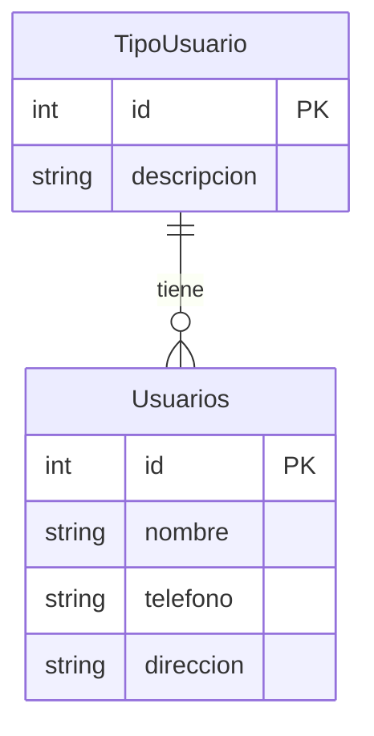

# 📐 MER — TipoUsuario vs Usuarios (Clase 15-Ago-2026)

**Captura:** `Captura de pantalla 2026-08-15 075528.png`

## 📊 Entidades y Atributos

### 1. `TipoUsuario`
- `id` (PK)
- `descripcion`

### 2. `Usuarios`
- `id` (PK)
- `nombre`
- `telefono`
- `direccion`

## 🔗 Relación
- **Rombo:** `TipoUsuario` ── [ tiene / asigna ] ── `Usuarios`
- **Cardinalidad:** 1 : N (1 TipoUsuario -> N Usuarios)

## 📋 Diagrama Mermaid (MER)

