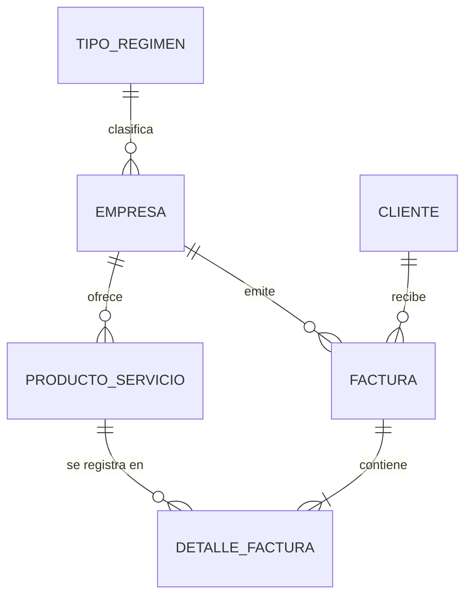

# 📐 Modelo Entidad-Relación (MER) — MiPrimeraEmpresa

**Proyecto:** MiPrimeraEmpresa (Portal de Formalización & Facturación para Microempresarios)  
**Módulo:** Gestión de Bases de Datos (CESDE - Nivel 1)  
**Entrega:** Avance 1 (Semana 6 - 29 de Agosto)

---

## 🎯 Definición de Entidades y Atributos

### 1. `EMPRESA` (Microempresa Registrada)
- `id_empresa` (PK, Entero, Autoincremental)
- `nit_rut` (Texto, Único) — NIT o Cédula de Ciudadanía del comerciante
- `razon_social` (Texto) — Nombre comercial de la microempresa
- `direccion` (Texto)
- `telefono` (Texto)
- `email` (Texto)
- `fecha_registro` (Fecha)
- `id_tipo_regimen` (FK)

### 2. `TIPO_REGIMEN` (Catálogo Jurídico/Tributario DIAN)
- `id_tipo_regimen` (PK, Entero)
- `nombre_regimen` (Texto) — Ej: "Persona Natural Comerciante (No Responsables IVA)", "Régimen Simple (RST)"
- `descripcion` (Texto)
- `aplica_iva` (Booleano)

### 3. `CLIENTE` (Comprador/Consumidor)
- `id_cliente` (PK, Entero, Autoincremental)
- `documento` (Texto, Único) — NIT/Cédula
- `nombre_completo` (Texto)
- `email` (Texto)
- `telefono` (Texto)

### 4. `PRODUCTO_SERVICIO` (Catálogo de Oferta)
- `id_producto` (PK, Entero, Autoincremental)
- `codigo_sku` (Texto)
- `nombre` (Texto)
- `precio_unitario` (Decimal)
- `aplica_iva` (Booleano)
- `id_empresa` (FK)

### 5. `FACTURA` (Encabezado de Venta/Factura)
- `id_factura` (PK, Entero, Autoincremental)
- `numero_factura` (Texto, Único) — Ej: FE-2026-0001
- `fecha_emision` (Fecha/Hora)
- `total_bruto` (Decimal)
- `total_iva` (Decimal)
- `total_neto` (Decimal)
- `id_empresa` (FK)
- `id_cliente` (FK)

### 6. `DETALLE_FACTURA` (Líneas de Compra — Relación M:N Descompuesta)
- `id_detalle` (PK, Entero, Autoincremental)
- `id_factura` (FK)
- `id_producto` (FK)
- `cantidad` (Entero)
- `precio_unitario` (Decimal)
- `subtotal` (Decimal)

---

## 📊 Diagrama Entidad-Relación (Mermaid)

---

## 🔒 Justificación de Normalización (1FN, 2FN, 3FN)

1. **Primera Forma Normal (1FN):** Todos los atributos son atómicos (sin listas de productos en un solo campo). La relación M:N entre `FACTURA` y `PRODUCTO_SERVICIO` se rompe mediante la tabla intermedia `DETALLE_FACTURA`.
2. **Segunda Forma Normal (2FN):** Todos los atributos no clave en `DETALLE_FACTURA` dependen de la clave primaria completa (`id_detalle`).
3. **Tercera Forma Normal (3FN):** No existen dependencias transitivas. El régimen fiscal de la empresa se extrae a `TIPO_REGIMEN` para evitar redundancias de IVA y reglas tributarias.
